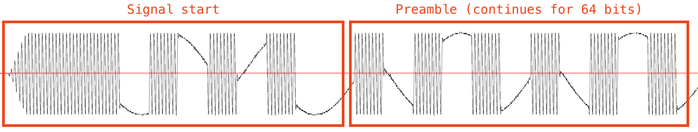
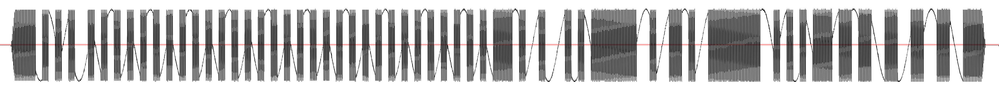
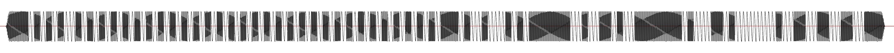

# QuietCool Whole House Attic Fan support in ESPHome and Home Assistant

> **Fork note:** This is a copy of the upstream project by **thadd** at
> <https://codeberg.org/thadd/quietcool-house-fan>, maintained here to add **receive** support
> (decode the physical remote's presses — including the timer buttons — and expose them to Home
> Assistant) for use with the [Climate Advisor](https://github.com/gunkl/ClimateAdvisor)
> integration. Full credit for the original transmit implementation and protocol
> reverse-engineering goes to thadd (and to Caleb Crome, cited below). The upstream repository
> does not currently include a LICENSE file; this copy is retained privately pending
> clarification of licensing/attribution with the original author.

This project aims to provide a way to add your QuietCool whole house attic fan to Home Assistant via ESP Home. Huge thank you to Caleb Crome who reverse engineered an older model and released the code on [his Github](https://github.com/ccrome/quiet-cool-rf-remote). My version of this works on the newer fans that use the "glass" remote with touchscreen buttons rather than physical ones.

The QC fans require the remote to be paired with the fan so you have two options for how to connect. You either need to know the ID value of your existing remote or you need to pair a "remote" with a new ID to your fan. See the comments in the sample [component.yaml](component.yaml) file for details.

# Quickstart

First you will need an ESP32 and a CC1101 chip. Both of these are easily available online. You'll need to wire them up together either just on a breadboard or soldered and mounted in a nice little box. Here is what my finished device looks like:

You can use the ESP32's default SPI pins or any of the digital IO pins, you'll just need to make sure the pin settings in the component YAML match how you have things wired up. Note that my CC1101 chip has a max voltage of 3.6V so make sure you don't wire it to the 5V output of the ESP32 or direct to your power supply if you're using 5V.

Once you have your hardware all squared away, you'll need [ESPHome](https://esphome.io). For most uses, you're probably using ESPHome along side [Home Assistant](https://home-assistant.io). Either way, the easiest thing to do is to launch your ESPHome dashboard and add a new device. You'll probably want to add more configuration options like wifi, Home Assistant connection, and captive portal setup to the component.yaml. Typically your ESPHome configuration will do that and you can just paste the contents of this repository's [component.yaml](component.yaml) at the end of the stuff that the new device wizard creates.

Simply change the settings in the YAML to match your pins and remote ID (see comments for how to determine remote ID if you don't know it and aren't pairing), install to the ESP32 using the ESPHome dashboard, and you should now be able to control your house fan from the ESP32 device. If you're using ESPHome in Home Assistant it should show up as a fan device. If you're not using Home Assistant you can add `web_server:` to the component YAML and navigate to the device's IP address (visible from the device logs in ESPHome) in a browser and control it from there.

## Troubleshooting

If you are able to read your remote's ID but the ESP32 isn't controlling your fan, try changing the frequency value in the component YAML. The CC1101 chips aren't perfect and so their centers may not be dialed in out of the box. Increase or decrease the value 0.01MHz at a time and retry. One user reported theirs started working at 433.96MHz so try stepping it up to 0.1MHz in either direction and if it still doesn't work, let me know by submitting an Issue here or commenting on the [Home Assisant community thread](https://community.home-assistant.io/t/quietcool-whole-house-fan-rf-glass-remote-integration/1012030?u=thadd).

# Reverse Engineering the QuietCool RF Protocol

I'll describe my process below but will give the details of the protocol first. I believe the remote uses a Silicon Labs radio chip. That doesn't really matter, but the sync word used matches the Si4xxx series chips' default sync word so I think it's a safe bet. Everything else is somewhat standard RF formats with one exception.

## Radio settings

The following are the transmit settings for the signals:

| Parameter         | Value             | Notes                                                             |
|-------------------|-------------------|-------------------------------------------------------------------|
| Modulation        | 2-FSK             |                                                                   |
| Data rate         | 2400bps           |                                                                   |
| Packet mode       | Variable length   | All commands have 6 bytes of data but use variable length format  |
| Sync mode         | 16/16             | Two-byte sync word                                                |
| Sync word         | 0x2d 0xd4         |                                                                   |
| Preamble length   | 8 bytes           | 64 bits of repeating '101010...'                                  |

## Packet format

| Field             | Size (bits)   | Example                                                   |
|-------------------|---------------|-----------------------------------------------------------|
| Start             | 8 (ish)       | 0x55                                                      |
| Preamble          | 64            | 10101010...                                               |
| Sync word         | 16            | 0x2D 0xD4                                                 |
| Length            | 8             | 6 (number of bytes in data payload (Remote ID + Command)  |
| Remote ID         | 32            | 0xCB 0x00 0xD5 0x12                                       |
| Command           | 8             | 0xBF                                                      |
| Command Repeat    | 8             | 0xBF                                                      |

Each packet is sent 3 times, separated by 70ms. The command codes are:

| Command   | Value   |
|-----------|---------|
| Wake      | 0x66    |
| On        | 0xBF    |
| Off       | 0x80    |
| Low       | 0x1F    |
| High      | 0x3F    |

I did not bother to capture the commands for timer settings since almost everyone would do that using their home automation anyway.

On every signal I captured, there was some leading zero padding followed by a sequence of 0x55 (`0 1 0 1 0 1 0 1`). Immediate after this, the preamble starts with `1 0 1 0 1 0...` repeating for 64 bits. I haven't been able to figure out what causes this first part of the signal but I suspect it's just noise from the transmitter ramping up. Thankfully this doesn't actually matter since the preamble and sync word are enough for the receiver to pick up the rest of the packet.

While this starting bit doesn't really affect the receiver, it did make reverse engineering the packets a little trickier since it affects where the preamble "starts". I found I actually needed to work backwards from the sync words to determine that the preamble was just a `1 0 1 0 1 0...` 64 bits in length.

## Notes

Understanding the packet format was the hardest part of this process. When I started digging into the signal analysis using URH, it was clear that the remote was sending each packet 3 times and that it also sends a command I called "wake" when you first click a button on the remote. I believe that this wake command is to make pairing easier.

It also seems that the fan itself echos back the packets it receives, but the signal is incredibly weak. I brought my laptop and SDR into the attic and was only barely able to see the signal appear and it wasn't clear enough to decode. There's no way the remote is able to receive that response with the minimal antenna it has inside the housing. I suspect QuietCool originally intended the fan to report the operating state back to the remote but ultimately abandoned that effort.

The full captures of the commands are in this repo at [signals.complex16s](signals.complex16s).

One other little quirk is that the carrier frequency on my remote is different from that on my friend's who has almost the same exact fan. The only difference between ours is that mine is the Eco version which shouldn't affect the signal at all.

You can see the difference here in two recordings of a full packet, first on my remote then on my friend's.

# Arduino version

While this repo provides a component YAML file that works in ESPHome without any other code or components, I also developed a proof-of-concept with the same hardware using pure arduino code.

Before I fully decoded the packet format, I was able to get basic controls by writing raw data to the CC1101 chip (as opposed to using its packet formats and preamble generation). The code in the `arduino` directory is the result of this effort if you want to look at it and fiddle with it.

The arduino version provides the ability to read your remote ID and is also the only way to produce the "wake" command so it may be useful for other efforts. I will note that the arduino code could be rewritten now that I understand the full packet structure but for now it just has the entire start + preamble embedded as the "sync word" and the sync word + length + ID as the id.
